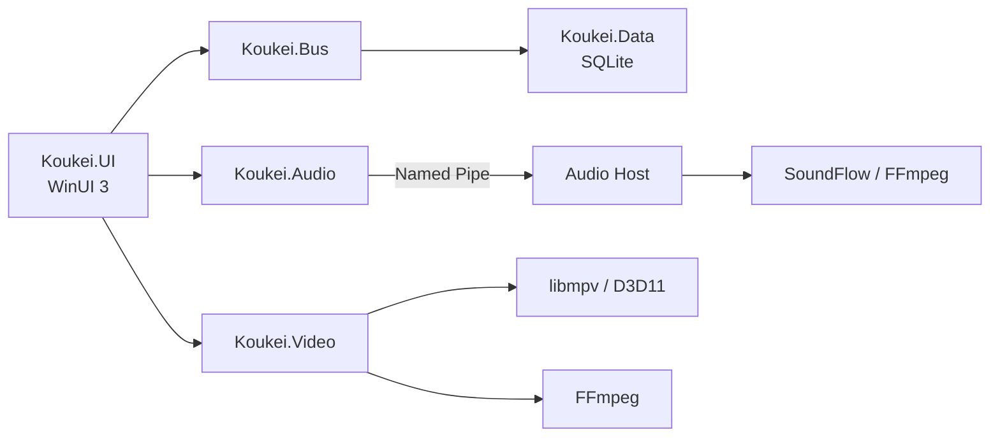

<div align="center">

# Koukei

**A modern, local-first media library and player for Windows.**

Organize, browse, and play your local videos and music in one native desktop app.


[Highlights](#highlights) · [Formats](#formats) · [Getting Started](#getting-started) · [Build](#build) · [Testing](#testing)

</div>

## Highlights

- **Media library** — Import files or folders, extract metadata and artwork, search, sort, rate, and favorite.
- **Video player** — Seek previews, chapters, audio/subtitle tracks, external subtitles, speed control, PiP, fullscreen, and screenshots.
- **Audio player** — Album art, metadata, synchronized LRC/embedded lyrics, media keys, shuffle, and repeat.
- **Unified queue** — Mix audio and video, reorder items, and save the queue as a playlist.
- **Local-first** — Media stays in place; library data is stored locally in SQLite.
- **Native Windows UI** — WinUI 3, light/dark themes, responsive layouts, English and Simplified Chinese.

## Playback

| Video | Audio |
| --- | --- |
| libmpv + D3D11 Composition | SoundFlow + FFmpeg |
| Dedicated player window | Mini player and expanded view |
| Chapters and seek thumbnails | Synchronized lyrics |
| Track and subtitle selection | System media controls |
| 0.5x–2x speed | Resume playback |
| Fullscreen and picture-in-picture | Isolated audio host process |

Audio playback runs in a separate `Koukei.Audio.Host` process to reduce interruptions caused by UI work and managed GC.

## Formats

Common formats include:

- **Video:** MP4, MKV, AVI, MOV, WebM, WMV, MPEG, TS, M2TS, FLV
- **Audio:** MP3, FLAC, WAV, AAC, M4A, OGG, Opus, WMA, APE, DSD
- **Subtitles:** SRT, ASS, SSA, VTT, SUB/IDX, SUP

<details>
<summary>Full extension list</summary>

| Type | Extensions |
| --- | --- |
| Video | `.3g2` `.3gp` `.asf` `.avi` `.divx` `.f4v` `.flv` `.m2ts` `.m4v` `.mkv` `.mov` `.mp4` `.mpeg` `.mpg` `.mts` `.ogv` `.rm` `.rmvb` `.ts` `.vob` `.webm` `.wmv` |
| Audio | `.aac` `.ac3` `.aif` `.aiff` `.alac` `.amr` `.ape` `.au` `.caf` `.dff` `.dsf` `.dts` `.eac3` `.flac` `.m4a` `.mka` `.mp3` `.mpc` `.oga` `.ogg` `.opus` `.ra` `.tak` `.tta` `.wav` `.weba` `.wma` `.wv` |
| External audio | `.mp3` `.flac` `.aac` `.ogg` `.wav` `.m4a` `.opus` `.wma` `.mka` `.ac3` |
| External subtitles | `.srt` `.ass` `.ssa` `.sub` `.idx` `.sup` `.vtt` |

</details>

## Getting Started

### Requirements

- Windows 10 version 1809 or later
- x64 architecture
- [.NET 8 SDK](https://dotnet.microsoft.com/download/dotnet/8.0)
- Windows x64 `libmpv-2.dll`

```powershell
git clone https://github.com/AliceClock/Koukei.git
cd Koukei
```

Place libmpv at:

```text
native/mpv/win-x64/libmpv-2.dll
```

Then run:

```powershell
dotnet restore Koukei.slnx -p:Platform=x64
dotnet run --project Koukei.UI/Koukei.UI.csproj `
  -c Debug `
  -p:Platform=x64 `
  --launch-profile "Koukei.UI (Unpackaged)"
```

You can also open `Koukei.slnx` in Visual Studio 2022 and run `Koukei.UI` using the `x64` platform.

## Architecture



## Build

```powershell
dotnet build Koukei.slnx -c Debug -p:Platform=x64
```

Release folder publish:

```powershell
dotnet publish Koukei.UI/Koukei.UI.csproj `
  -c Release `
  -p:Platform=x64 `
  -r win-x64 `
  --self-contained true `
  -p:PublishSingleFile=false `
  -p:PublishTrimmed=false `
  -p:PublishProfile=
```

> [!NOTE]
> Native media runtimes currently support `win-x64` only. The deployed audio host still requires the .NET 8 Runtime.

## Testing

Run the complete suite from an unlocked Windows desktop:

```powershell
.\scripts\test.ps1
```

For non-interactive environments, run the core tests and UI contracts without launching a window:

```powershell
.\scripts\test.ps1 -SkipUiAutomation
```

The suite has three layers:

- **Core tests** exercise lyrics and subtitle parsing, application settings, playlists, user media state, SQLite behavior, and database migrations.
- **UI contracts** validate every source XAML file, bilingual resource parity and `x:Uid` resolution, and stable globally unique automation IDs.
- **UI navigation smoke** launches a self-contained unpackaged x64 build with isolated temporary data, then drives Home, Video, Audio, Playlists, and Settings through Windows UI Automation.

The UI smoke test needs an interactive, unlocked desktop. On failure it writes startup logs, a screenshot, and the UI Automation tree under `TestResults/ui-smoke`. Set `KOUKEI_UI_EXE` to test an alternate executable. Pushes and pull requests run the non-interactive layers through GitHub Actions; the real-window smoke test is available from the workflow's manual `run_ui_automation` option.

Runtime overrides:

- `KOUKEI_MPV_HOME` — directory containing `libmpv-2.dll`
- `KOUKEI_FFMPEG_HOME` — directory containing the FFmpeg DLLs
- `KOUKEI_USER_DATA_HOME` — isolated application data directory, primarily for automation

## Tech Stack

`C#` · `.NET 8` · `WinUI 3` · `Windows App SDK` · `libmpv` · `FFmpeg` · `SoundFlow` · `EF Core` · `SQLite`

## License

Third-party media notices are available in [`THIRD-PARTY-NOTICES.md`](./THIRD-PARTY-NOTICES.md).

Koukei does not currently include a project-level `LICENSE`. Third-party licenses do not grant permission to use or redistribute Koukei source code.

---

<div align="center">

If you like the project, consider leaving a ⭐.

</div>
